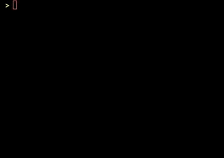

# Expression Compiler
> Simple language compiler that is driven by mathematical expressions and compiled into c++ code


<p align="center" >
    
    
    
</p>

### About
The expression language compiler transpiles expression language programs into c++ source files. The expression language is a very simple language that can print values to the screen and take user input, it can save input into variables, and also apply arithmetic operations with variables and numerical literals.  The grammar for the expression language is as follows:

```
<variable>          =>  /^[a-zA-Z]+[a-zA-Z0-9_]*$/
<string_literal>    =>  /^"(?:[^"]|\\")*"$/
<numeric_literal>   =>  /^(?:[0-9]+(?:\.[0-9]+)?|(?:\.[0-9]+))$/
<program>           =>  <statement> <more_stmts>
<more_stmts>        =>  <statement> <more_stmts> | ;
<statement>         =>  <input> ";" | <output> ";" | <assignment> ";"
<input>             =>  <input_op> <more_input>
<more_input>        =>  <input> | ;
<input_op>          =>  ">>" <variable>
<output>            =>  <output_op> <more_output>
<more_output>       =>  <output> | ;
<output_op>         =>  "<<" <output_val>
<output_val>        =>  <variable> | <string_literal> | <numeric_literal>
<assignment>        =>  <variable> "=" <combination>
<combination>       =>  <factor> <combination_prime>
<combination_prime> =>  "+" <factor> <combination_prime> | "-" <factor> <combination_prime> | ;
<factor>            =>  <power> <factor_prime>
<factor_prime>      =>  "*" <power> <factor_prime> | "/" <power> <factor_prime> | ;
<power>             =>  <fork> "^" <power> | <fork>
<fork>              =>  "(" <combination> ")" | <variable> | <numeric_literal>
```

### Examples
An example program written in expression language can be found below. The program simply asks the user for a radius and computes the area and circumference of a circle with the given radius. An expression language program has the extension __el__.

```
<< "Enter radius >> ";
>> r;

pi = 3.14159;

A = pi*r^2.0;
C = 2*pi*r;

<< "Area: "          << A << "\n";
<< "Circumference: " << C << "\n";
```

Assuming that the above expression language program is saved to a file named _main.el_. You can transpile the program above to c++ code by running the following command:

```bash
./bin/elc main.el
```

### Build System
This project uses a simple makefile for it's _build system_. Run `make elc` to compile the expression language compiler–the bindary can be found in the _bin_ folder. Run `make tests` to compile the test suite–the binary can be found in the _bin_ folder.

### Program Execution
Once the expression language source code is transpiled into c++, you can compile the outputted c++ code using _g++_ as follows:

```bash
g++ source.cpp -o main
```

The program can then be ran as follows:

```bash
./main
```

In order to run tests run the following:

```bash
./bin/tests
```

If nothing shows up, then all tests passed successfully. Otherwise, it will display which tests failed.

### Limitations
The expression language compiler is very simple and the compiler itself has no options. One thing to implement in the future is to specify the path for the outputted transpiled c++ file. Another thing to implement is to compile with g++ right after generating the transpiled c++ source code.

### Acknowledgments
This project was part of the curriculum for CS473–Compilers at the University of Illinois at Chicago. Test cases were written by Professor Hummel.
